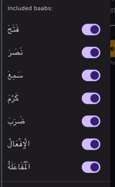
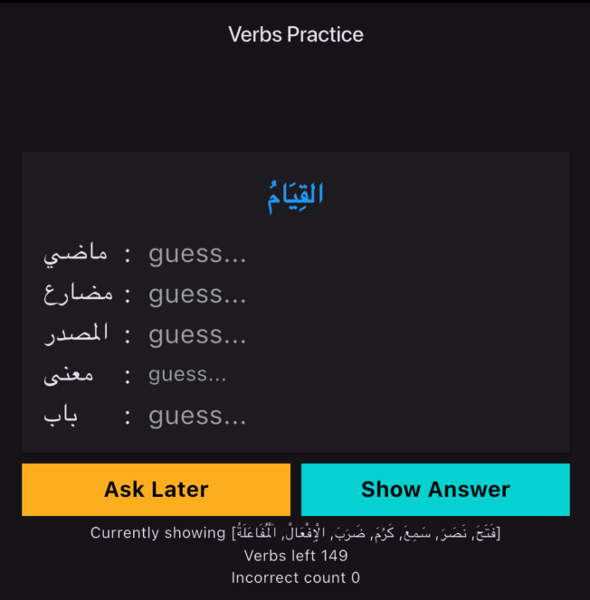
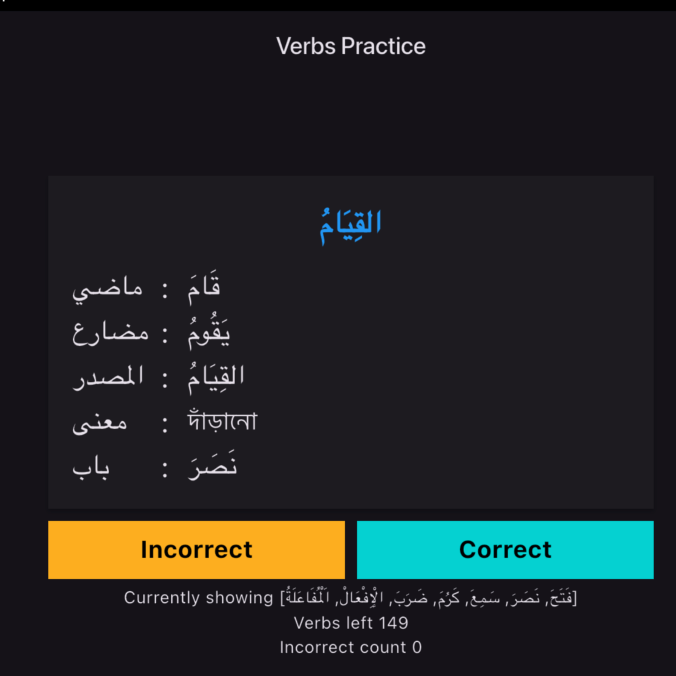
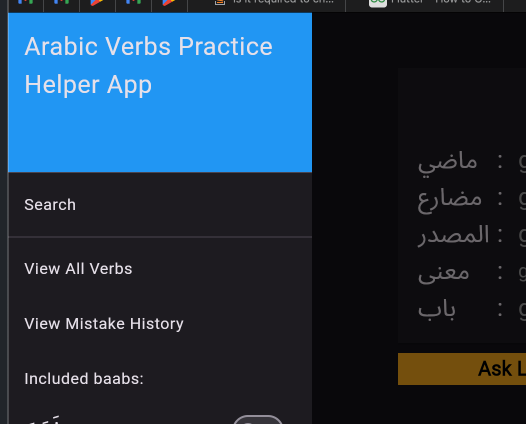

## Arabic Baab Practice

আসসালামু আলাইকুম। এই অ্যাপটি মূলত বানিয়েছি সিবাওয়ে এর আরবি ভাষা শিক্ষা কোর্স https://sibawayhinst.com/course/details/aragn করার সময় فعل মুখস্ত এবং রিভিশন নিতে সহায়তা করার জন্য। আমার ব্যাচের অন্যান্য ছাত্রদের অনুরোধে অ্যাপটি পাবলিক করলাম। আপনাদের করো কাজে লাগলে দোয়া করবেন  

### Getting Started

এখন পর্যন্ত নিম্নের বাব সমূহ দেয় হয়েছে। সামনে আরও কোর্স অগ্রসর হলে আরো অ্যাড করবো ইনশাআল্লাহ। 

প্রাকটিস এর জন্য মেনু থেকে নির্দিষ্ট বাব enable/disable করতে পারবেন।

প্রেকটিস মুড এ আপনাকে একটা random শব্দ দিয়ে প্রশ্ন করা হবে, আপনাকে তার মাদী, মুদারি, মাসদার, অর্থ এবং ব্যাব বের করতে হবে 

আপনার উত্তর চিন্তা করা হলে/বলা হলে show answer চাপুন। 

আপনার guess করা উত্তর এর সাথে সঠিক উত্তর মাইল গেলে Correct নাহলে Incorrect চাপুন। আপনার ভুল উত্তর দেয় শব্দগুলো পরবর্তীতে আবার randomly আপনাকে জিজ্ঞেস করা হবে যতক্ষণ আপনি সঠিক উত্তর না দিতে পারেন।  

আপনি আপনার বেশী ভুল হওয়া শব্দ গুলো একসাথে দেখতে পারবেন মেনু > ভিউ মিসটেক হিস্ট্রি থেকে 

### 📲 Get the App

Get the app on your favorite platform:

### Android (Google Play Store)

### iOS (Apple App Store) (coming soon)

### Web (using any browser)
[On Browser](https://shababhsiddique.github.io/arabic-baab-app/)

### Deploy

For deploying the web version

`
flutter build web --release --base-href="/arabic-baab-app/"
`
And copy everything from build/web to docs/
privacy policy exist on docs do not delete it.

For building app bundle for Google Play Store

`
flutter build appbundle --release
`

### Thanks

অ্যাপটির মধ্যে ব্যবহার করা আরবি কোন বানান ভুল অথবা অর্থ ভুল পেলে, কিংবা অ্যাপ এ কোন ত্রুটি চোখে পড়লে https://github.com/shababhsiddique/arabic-baab-app/issues এখানে জানানোর অনুরোধ রইল। 

ধন্যবাদ 